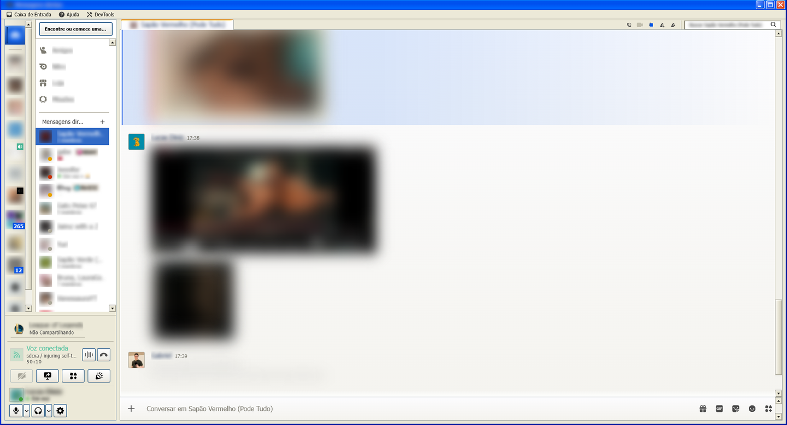
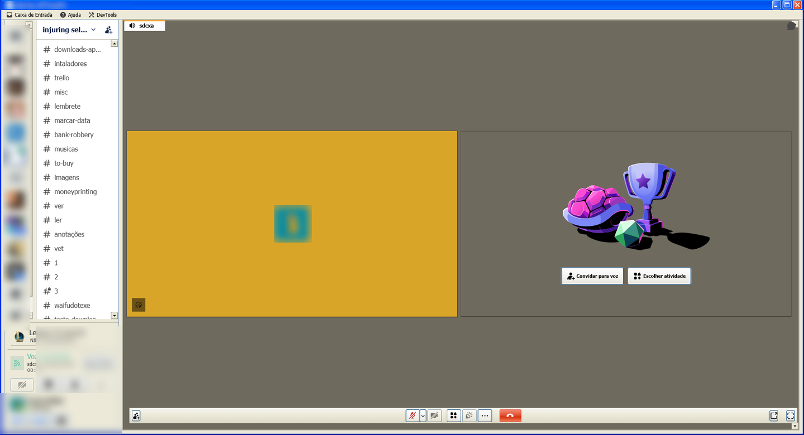

# XPLuna

Tema do **Windows XP (Luna)** para o Discord, feito para o [Vencord](https://vencord.dev).

Barra de título com o gradiente azul do Luna, barra de menu, abas de janela,
botões biselados, campos afundados e barra de rolagem com setas — inclusive nas
telas que o Discord costuma esquecer: Loja, Missões, Nitro, chamada de voz,
visualizador de imagem e os modais.

## Instalação

1. Baixe o `XPLuna.theme.css`.
2. Coloque em `%APPDATA%\Vencord\themes` (Windows) ou na pasta de temas do seu
   sistema — o botão **Abrir pasta de temas** nas configurações do Vencord leva
   até lá.
3. Ative em **Configurações do Vencord → Temas**.

Não precisa de plugin nenhum. O tema importa o
[midnight](https://github.com/refact0r/midnight-discord) do refact0r como base,
então a internet é necessária no primeiro carregamento.

## Mais telas

| Amigos | Loja |
|---|---|
|  |  |

| Chamada de voz | Servidor |
|---|---|
|  |  |

## O que está coberto

- Moldura de janela, barra de título e barra de menu funcional
  (Caixa de Entrada, Ajuda, DevTools)
- Aba de janela para o canal aberto, encaixada no painel da conversa
- Botões, campos, sliders e barras de rolagem no estilo Luna
- Modais com moldura de janela e X vermelho
- Loja, Missões e Nitro
- Tela de chamada de voz e visualizador de imagem
- Markdown: bloco de código, citação e spoiler

## Compatibilidade

- Discord desktop (Electron). No navegador falta a barra de título nativa.
- **RadialStatus**: incompatível. O tema deixa os avatares quadrados removendo
  a máscara SVG, que é a mesma que o RadialStatus usa para desenhar o anel.
- Idioma: os rótulos da barra de menu saem do `aria-label` do próprio Discord,
  então acompanham o idioma do app.

## Performance

O tema é medido, não estimado: inserir um nó no DOM custa ~6 ms com ele ligado
(contra ~1 ms sem tema). A regra que mais pesa em tema de Discord é `:has()`
com sujeito próximo da raiz — uma única regra dessas levou esse número a 89 ms
durante o desenvolvimento e foi removida. Detalhes em [CLAUDE.md](CLAUDE.md).

## Créditos

- Base: [midnight](https://github.com/refact0r/midnight-discord) — refact0r
- Referência visual: [XP.css](https://botoxparty.github.io/XP.css/) — botoxparty
